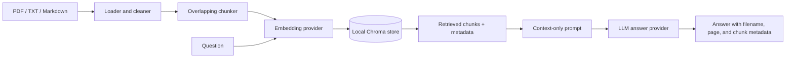

# Local RAG Document Q&A

Ask questions over local PDF, TXT, and Markdown files. Documents are indexed into a persistent local Chroma database; OpenAI is used only for configured embeddings and answer generation.

## Architecture



The OpenAI SDK appears only in `providers.py`. The loader, chunker, retrieval formatter, prompt builder, and service depend on small protocols and are tested without external calls.

## Setup

```powershell
python -m venv .venv
.\.venv\Scripts\Activate.ps1
pip install -r requirements.txt
Copy-Item .env.example .env
```

Set `OPENAI_API_KEY` in local `.env` or the shell. `OPENAI_CHAT_MODEL`, `OPENAI_EMBEDDING_MODEL`, `RAG_CHUNK_SIZE`, `RAG_CHUNK_OVERLAP`, `RAG_TOP_K`, and `RAG_MIN_SCORE` are configurable in the environment. Never commit `.env`.

## Run

```powershell
$env:PYTHONPATH = "src"
python -m rag_qa.cli index .\documents
python -m rag_qa.cli ask "What is the cancellation policy?"
```

`index` recursively accepts `.pdf`, `.txt`, and `.md` files. `ask` prints an answer and the source metadata used. If no chunk meets the configured relevance threshold, it returns: **“The information was not found in the retrieved documents.”**

## Testing and evaluation

```powershell
$env:PYTHONPATH = "src"
python -m unittest discover -s tests -v
```

All tests use fake vector stores, embeddings, or LLMs; they never call OpenAI. [`evaluations/questions.json`](evaluations/questions.json) provides 10 evaluation questions to run against an appropriately indexed document set.

## RAG failure modes

- **Missing or poor source text:** scanned PDFs without text layers, malformed files, or cleaning errors reduce recall.
- **Chunk boundaries:** an answer split across chunks may be missed; tune size and overlap for the corpus.
- **Embedding mismatch:** semantic retrieval can select a related but wrong passage, especially for names, figures, or rare terms.
- **Threshold tuning:** a high threshold returns “not found” too often; a low threshold supplies irrelevant context.
- **Generation hallucination:** retrieved context does not guarantee a grounded answer. The prompt forbids unsupported claims, but important answers need human verification.
- **Index freshness:** edits are not visible until the relevant files are indexed again.

## Security and limitations

Keys come only from environment variables and are never hard-coded. Treat indexed documents and generated answers as sensitive data. This learning project has no OCR, access control, authentication, incremental deletion, citation verification, or evaluation automation. Chroma is local, while configured OpenAI embedding and answer calls send input text to that provider.
