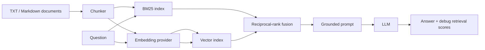

# Hybrid RAG Search

Hybrid document Q&A combines lexical BM25 retrieval with dense vector similarity, then uses the merged context for a grounded LLM answer.

## Architecture



## Fusion method

Each retriever returns a ranked list. Reciprocal-rank fusion (RRF) assigns every result `1 / (60 + rank)` from each list and adds the values. This rewards documents that rank well in either method and especially those that both methods agree on. `top_k` controls each retrieval list and the final fused list.

BM25 is precise for exact terms, identifiers, and uncommon names; embeddings improve semantic paraphrase recall. Hybrid search costs an embedding call and uses more memory than keyword search alone; rank fusion ignores the raw score scale, which makes it robust but less tunable.

## Setup and run

```powershell
python -m venv .venv
.\.venv\Scripts\Activate.ps1
pip install -r requirements.txt
Copy-Item .env.example .env
$env:PYTHONPATH = "src"
python -m hybrid_rag.cli index .\documents
python -m hybrid_rag.cli ask "What is the cancellation policy?" --top-k 4 --debug
python -m hybrid_rag.cli evaluate
```

Keys and model settings come only from environment variables. Do not commit `.env`.

## Evaluation and testing

`evaluations/questions.json` contains 15 questions with the chunk IDs expected to support them. `evaluate` calculates retrieval hit rate: the percentage of questions for which an expected chunk appears in the fused top-k. The supplied deterministic evaluation fixture reports **100.0% (15/15)**; real-corpus scores must be measured after indexing that corpus.

```powershell
python -m unittest discover -s tests -v
```

Tests use fake embeddings, LLMs, and retrievers; no test calls an external API.

## Limitations, failures, and security

Poor chunking, OCR errors, stale indexes, ambiguous queries, or unsuitable embeddings can keep relevant text out of the top-k. An LLM can still overstate what context supports, so the prompt requires it to say that information was not found when context is insufficient. This project has no PDF/OCR loader, persistent index, authentication, or automatic truth verification. Indexed text and API keys may be sensitive; keys are read from `OPENAI_API_KEY`, never hard-coded.
